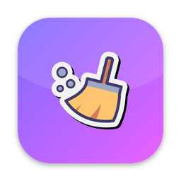

<p align="center">
  
</p>

<h1 align="center">MacBroom</h1>

<p align="center">
  A free, open-source <b>CleanMyMac alternative for macOS</b> — a one-click menubar app that
  clears caches and developer junk, uninstalls apps with their leftovers, and shows disk usage.
</p>

<p align="center">
  <a href="https://github.com/jejezz/garbage-cleaner-for-mac/releases/latest"></a>
  <a href="https://github.com/jejezz/garbage-cleaner-for-mac/releases"></a>
  
  
  <a href="LICENSE"></a>
</p>

<p align="center">
  
</p>

## Features

- **Smart Scan** — finds junk by category with a safety rating (Safe / Rebuilds / Review):
  user caches & logs, Xcode DerivedData, iOS DeviceSupport & simulators, Gradle, Dart pub,
  CocoaPods, npm/Yarn/pnpm, Homebrew, pip …
- **Uninstaller** — removes an app together with its leftovers in `~/Library`, matched by bundle id
- **Disk gauge** — Finder-accurate usage ring (purgeable space counts as free) with a live preview of
  how much the current selection would free
- **Menubar app** — one click to open, no Dock icon, `Hide` to tuck it away
- **Reversible** — everything is moved to the Trash, never hard-deleted
- **Guided setup** — a step-by-step walkthrough for granting Full Disk Access

<p align="center">
  
  
</p>

## Install

Download the latest `MacBroom-<version>.dmg` from
[**Releases**](https://github.com/jejezz/garbage-cleaner-for-mac/releases/latest), open it and drag
MacBroom to Applications.

The app is not notarized yet, so on first launch **right-click MacBroom.app → Open → Open** once
(or run `xattr -d com.apple.quarantine /Applications/MacBroom.app`). Then grant Full Disk Access
when the banner appears — *Show me how* walks you through it.

## Why Flutter?

Dart drives the UI and all scanning logic; a ~100-line Swift bridge
([`NativeBridge.swift`](macos/Runner/NativeBridge.swift)) covers the few things Dart can't do on
macOS — move to Trash, Full Disk Access check, volume capacity, bundle info, reveal in Finder.

## Development

```bash
flutter run -d macos
```

Click the broom icon in the menubar. Right-click for Quit.

## Design

Dark glossy theme, defined once in `lib/theme/broom_theme.dart` (colors,
gradients, type). Reusable pieces live in `lib/widgets/`:
`GlassCard`, `GradientButton`/`GhostButton`, `BroomCheckbox`, `Pill`,
`DiskRing` (glowing gradient gauge), `NavRail`, `FreedOverlay`
(post-clean celebration), `showConfirm` (glass dialog).

## Layout

```
lib/
  main.dart                     tray icon + popover window + nav rail shell
  theme/broom_theme.dart        design tokens
  core/
    scan_targets.dart           ← THE list of junk categories. Add entries here.
    scanner.dart                sizes targets with `du -sk` (fast on 500k-file trees)
    app_scanner.dart            lists /Applications, finds leftovers per bundle id
    app_state.dart              ChangeNotifier the pages read from
    native_bridge.dart          Dart side of the MethodChannel
    format.dart                 byte formatting
  features/
    dashboard/  junk/  apps/    one page each
  widgets/                      glass, buttons, disk_ring, nav_rail, freed_overlay, confirm_dialog
macos/Runner/
  NativeBridge.swift            the only Swift: trash, FDA check, volume info,
                                bundle info, reveal in Finder
```

## Adding a junk category

Append a `ScanTarget` to `scanTargets` in `lib/core/scan_targets.dart`:

```dart
ScanTarget(
  id: 'yarn',
  title: 'Yarn Cache',
  description: 'Downloaded packages.',
  group: 'Developer',
  paths: ['~/Library/Caches/Yarn'],
  safety: Safety.rebuild,   // safe | rebuild | review (review = unchecked by default)
  listChildren: false,      // true = each sub-folder becomes its own row
),
```

No other code changes are needed.

## Adding a native (Swift) call

1. Add a `case "myMethod":` in `macos/Runner/NativeBridge.swift`.
2. Add a static wrapper in `lib/core/native_bridge.dart`.

## macOS config already applied

- `macos/Runner/*.entitlements` — App Sandbox **off** (required to touch other apps' caches; not App Store-compatible).
- `macos/Runner/Info.plist` — `LSUIElement = true` (menubar-only, no Dock icon).
- `AppDelegate.swift` — app keeps running when the popover hides.
- Full Disk Access is optional; the dashboard shows a banner with a deep link to the setting when it is off.

## Release / Distribution

Push a `v*` tag and [.github/workflows/release-macos.yml](.github/workflows/release-macos.yml)
builds the `.dmg`/`.zip` and opens a draft GitHub Release for you. Step-by-step checklist,
including the local build path: [docs/RELEASE.md](docs/RELEASE.md).

```bash
./scripts/release.sh
```

Produces `dist/MacBroom-<version>.dmg` (drag-to-Applications) and
`dist/MacBroom-<version>.zip`. Version comes from `pubspec.yaml`.

**Without an Apple Developer account** the app is ad-hoc signed: it runs, but
Gatekeeper shows "cannot verify" on first launch — the user must right-click →
Open once (or `xattr -d com.apple.quarantine MacBroom.app`).

**With a Developer ID certificate** (Apple Developer Program, $99/yr):

```bash
# once: store notarization credentials in the keychain
xcrun notarytool store-credentials macbroom \
    --apple-id you@example.com --team-id TEAMID --password <app-specific-password>

# every release: sign with Hardened Runtime, notarize, staple
SIGNING_IDENTITY="Developer ID Application: Your Name (TEAMID)" \
NOTARY_PROFILE=macbroom ./scripts/release.sh
```

Not App Store-eligible: the App Sandbox is off so the app can reach other
apps' caches.

## License

[MIT](LICENSE)
